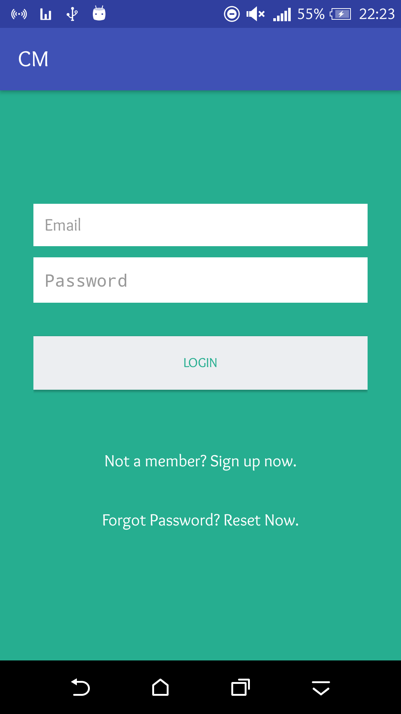

# cm-bs-repo

## Setting up php server
1. XAMPP / WAPP should be installed in your machine
2. Copy the folder PHP_API to C:\xampp\htdocs\
3. try http://localhost/PHP_API/index.php
4. Open phpmyadmin, create a database `test` if not exist
5. Import `PHP_API/db/database.sql` to this database
6. You need to edit the script `PHP_API/include/Config.php` with correct configuration
7. API Server is ready to go

## Setting up Android Project
1. Open `Android/CM/` in android studio
2. Make the project once.
3. Edit `Android/CM/app/src/main/java/todofy/cm/app/AppConfig.java` with correct urls corresponding to your localhost
4. Make again
5. Run on emulator

## Screenshots
Login 
Register 
Reset Password 
dashboard - to be done
Reset password web: to be done
